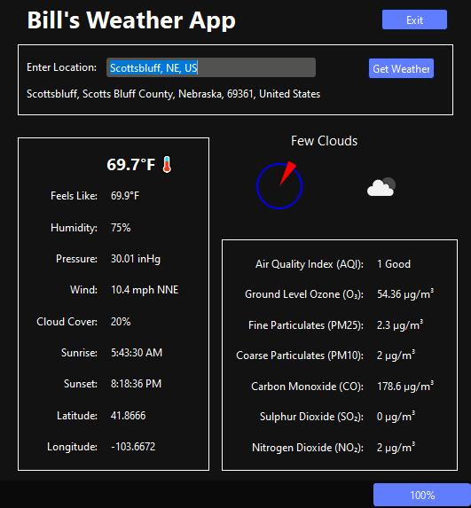

# Python OpenWeatherMap Program using PySide6

## Overview

- Python PySide6 GUI program using requests, OpenWeatherMap API, OpenWeatherMap Air Pollution API, and Nominatim from geopy.
- Includes current weather and AQI (Air Quality Index).
- The ui was built (and a lot of time was saved) using QT Designer.
- Air Quality Index is a separate API call from the OpenWeatherMap Air Pollution API.
- The lat and long retrieved from OpenWeatherMap is reverse geocoded from the name of the location using Nominatim from geopy.
  - The reverse geocoding from geopy confirms that we have the weather for the right city.
- JSON sample response files used to build the program are in the json_response_files folder.
- A batch file is included for nuitka building to a Windows exe (nuitka_gui.bat)
  - Install nuitka: pip install nuitka

### Acknowledgement

I used the following book to get started with PySide6:

[Create GUI Applications with Python & Qt6](https://www.pythonguis.com/pyside6-book)
(The hands-on guide to making apps with Python)

by Martin Fitzpatrick

### API Key

- To run the program, go to openweathermap.org. Get a free API key.
- Edit weather_utils.py. Put in your OpenWeatherMap API key.

### Changes

- 08/22/2021: Initial commit

### Purpose

I am an Information Technology Instructor at [Western Nebraska Community College](https://www.wncc.edu). I teach Information Technology, CyberSecurity and Computer Science. Best job ever!

- Facebook: [Facebook WNCC IT Program](https://www.facebook.com/wnccitprogram/)
- YouTube: [YouTube WINCC IT Program](https://www.youtube.com/@williamloringitinstructor)

### License

 This work is licensed under a <a rel="license" href="http://creativecommons.org/licenses/by-nc-sa/4.0/">Creative Commons Attribution-NonCommercial-ShareAlike 4.0 International License</a>.
Copyright (c) 2022 William A Loring
